# Software Requirements Specification (SRS)

## 1. Introduction

### 1.1 Purpose
The purpose of this document is to provide a detailed Software Requirements Specification (SRS) for the E-Commerce platform. This document outlines the functional and non-functional requirements, system design, and other aspects necessary for the development and deployment of the platform.

### 1.2 Scope
The E-Commerce platform will enable users to browse products, add them to their cart, and proceed to checkout. The platform will include user authentication, product management, order management, and payment processing. The MVP will focus on the core functionalities needed to make the platform operational.

### 1.3 Definitions, Acronyms, and Abbreviations
- **MVP**: Minimum Viable Product
- **API**: Application Programming Interface
- **UI**: User Interface
- **DB**: Database

### 1.4 References
- [ASP.NET Core Documentation](https://docs.microsoft.com/en-us/aspnet/core/)
- [Angular Documentation](https://angular.io/docs)

## 2. Overall Description

### 2.1 Product Perspective
The E-Commerce platform will be a standalone web application developed using ASP.NET Core for the backend and Angular for the frontend. The platform will interact with a MSSQL Server database to store and retrieve data.

### 2.2 Product Functions
- User Registration and Authentication
- Product Management (CRUD operations)
- Shopping Cart Management
- Order Placement and Management
- Payment Processing

### 2.3 User Classes and Characteristics
- **Admin**: Manages products, orders, and users.
- **Customer**: Browses products, adds them to the cart, places orders, and makes payments.

### 2.4 Operating Environment
- **Backend**: ASP.NET Core
- **Frontend**: Angular
- **Database**: MSSQL Server
- **Hosting**: Azure

### 2.5 Design and Implementation Constraints
- The system must be developed using ASP.NET Core and Angular.
- The database must be MSSQL Server.
- The system must support role-based authorization.

### 2.6 Assumptions and Dependencies
- Users have internet access.
- The system will use a third-party payment gateway (e.g., Stripe).

## 3. Specific Requirements

### 3.1 Functional Requirements

#### 3.1.1 User Registration and Authentication
- Users must be able to register with an email and password.
- Users must be able to log in with their credentials.
- Passwords must be stored securely using hashing.

#### 3.1.2 Product Management
- Admins must be able to create, update, delete, and view products.
- Products must have attributes such as name, description, price, and stock quantity.

#### 3.1.3 Shopping Cart Management
- Users must be able to add products to their shopping cart.
- Users must be able to view and update the quantity of products in their cart.
- Users must be able to remove products from their cart.

#### 3.1.4 Order Placement and Management
- Users must be able to place orders with the products in their cart.
- Users must receive an order confirmation upon successful placement.
- Admins must be able to view and manage orders.

#### 3.1.5 Payment Processing
- Users must be able to make payments using a third-party payment gateway.
- Payment status must be updated in the system.

### 3.2 Non-Functional Requirements

#### 3.2.1 Performance Requirements
- The system must handle up to 100 concurrent users.
- The system must respond to user actions within 2 seconds.

#### 3.2.2 Security Requirements
- User data must be encrypted during transmission.
- The system must implement role-based access control.

#### 3.2.3 Usability Requirements
- The UI must be intuitive and user-friendly.
- The system must be accessible on both desktop and mobile devices.

### 3.3 System Models

#### 3.3.1 Use Case Diagram

#### 3.3.2 Entity-Relationship Diagram (ERD)

```mermaid
%%{init: {'theme': 'base', 'themeVariables': { 'primaryColor': '#ffcc00', 'edgeLabelBackground':'#cccccc', 'tertiaryColor': '#fff', 'tertiaryTextColor': '#000'}}}%%
erDiagram
    USER {
        int userId PK
        string email
        string passwordHash
        string role
    }
    PRODUCT {
        int productId PK
        string name
        string description
        decimal price
        int stockQuantity
    }
    ORDER {
        int orderId PK
        int userId FK
        datetime orderDate
        decimal totalPrice
    }
    ORDER_ITEM {
        int orderItemId PK
        int orderId FK
        int productId FK
        int quantity
        decimal unitPrice
    }
    USER ||--o{ ORDER : places
    ORDER ||--|{ ORDER_ITEM : contains
    PRODUCT ||--o{ ORDER_ITEM : includes
```

## 4. Appendices

### 4.1 Glossary
- **CRUD**: Create, Read, Update, Delete
- **PK**: Primary Key
- **FK**: Foreign Key

### 4.2 References
- [ASP.NET Core Documentation](https://docs.microsoft.com/en-us/aspnet/core/)
- [Angular Documentation](https://angular.io/docs)
- [Stripe API Documentation](https://stripe.com/docs/api)
